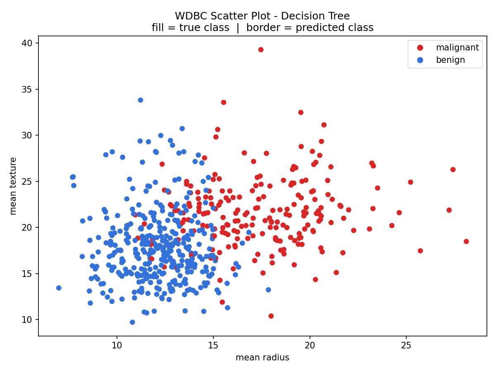
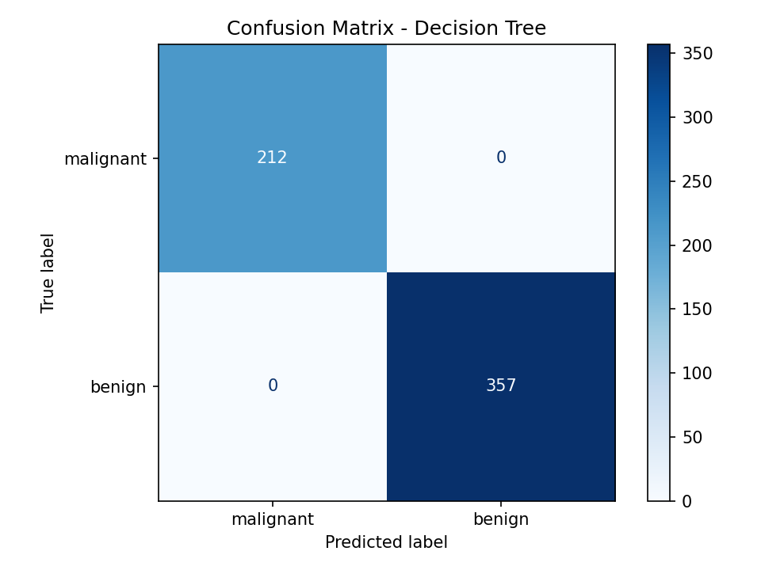

# WDBC Classification Project

## Project Overview
This is a machine learning project written in Python that classifies the Wisconsin Diagnostic Breast Cancer (WDBC) dataset with the help of scikit-learn library.

It reads the data and trains and compares more than one classifiers, tests their performances and provides output files such as confusion matrix and scatter plot.

---

## Objectives
- Use binary classification with scikit-learn.
- Train and compare several classifiers such as SVM, Decision Tree, KNN, Random Forest
- Assess models for accuracy, precision and recall
- Use a confusion matrix and scatter plot to visualize results
- Adhere to documentation conventions of open-source projects

---

## Dataset
- Wisconsin Diagnostic Breast Cancer (WDBC) is an acronym for the Wisconsin diagnostic breast cancer project.
The data comes from the built-in scikit-learn dataset (datasets.load_breast_cancer()).
- **Samples:** 569
- **Features:** 30
- **Classes:** malignant, benign

---

## Tools and Technologies
- Python 3
- scikit-learn
- NumPy
- Matplotlib
- Git / GitHub

---

## Environment
This project used:
- Visual Studio Code (recommended)

---

## Requirements
Install dependencies using:

```
pip install -r requirements.txt
```

### Imports Used
```python
import numpy
import matplotlib
from sklearn import datasets, svm, tree, neighbors, ensemble, metrics
```

---

## How to Run
```
python wdbc_classification.py
```

---

## Output Files
| File | Description |
|------|-------------|
| `wdbc_classification.py` | Main classification script |
| `wdbc_classification_scatter.png` | Scatter plot comparing true and predicted classes |
| `wdbc_classification_matrix.png` | Confusion matrix of the best classifier |
| `short_report.txt` | Short written report |
| `requirements.txt` | Packages that are required for Python |
| `LICENSE` | MIT license |

---

## Output Images

### Scatter Plot


### Confusion Matrix


---

## Best Classifier Result
| Classifier | Accuracy |
|------------|----------|
| SVM | 0.9227 |
| Decision Tree | 1.0000 |
| KNN | 0.9473 |
| Random Forest | 1.0000 |

## Best classifier: Decision Tree — Accuracy: 1.0000
